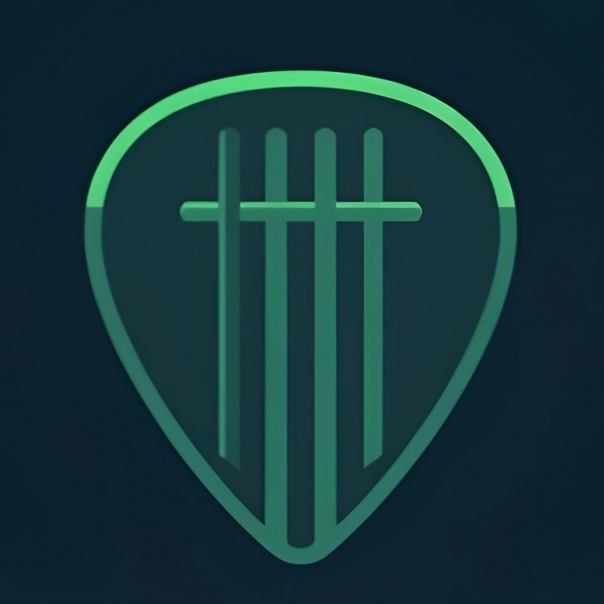

# ChordCrack

<div align="center">
  
  
  **Guitar Chord Ear Training Made Simple**
  
  [](https://developer.apple.com/ios/)
  [](https://swift.org/)
  [](LICENSE)
  [](https://apps.apple.com)
</div>

## About

ChordCrack is a comprehensive guitar chord ear training app designed to help guitarists develop their ability to identify chords by sound. Through progressive difficulty levels and intelligent hint systems, users can improve their musical ear while tracking their progress.

### Key Features

- **Daily Challenges**: Practice basic chords with 5-round daily sessions
- **Multiple Difficulty Levels**: Power chords, barre chords, blues chords, and mixed practice
- **Progressive Hint System**: Audio hints that gradually reveal more information
- **Apple Sign-In Integration**: Secure authentication with privacy-focused options
- **Cross-Device Sync**: Progress saved and synchronized across all your devices
- **Biometric Security**: Face ID / Touch ID support for secure access
- **Achievement System**: Unlock milestones as you improve
- **Statistics Tracking**: Detailed progress analytics and performance metrics

## Screenshots

<div align="center">
  
  
  
</div>

## Technical Overview

### Architecture
- **Frontend**: SwiftUI with MVVM architecture
- **Backend**: Supabase for authentication and data storage
- **Audio**: Custom AudioManager with progressive hint system
- **Authentication**: Apple Sign-In, email/password with secure validation

### Tech Stack
- **Language**: Swift 5.9+
- **Framework**: SwiftUI
- **Database**: Supabase (PostgreSQL)
- **Authentication**: Supabase Auth with Apple Sign-In
- **Audio**: AVFoundation, AVAudioPlayer
- **Security**: LocalAuthentication (Face ID/Touch ID)
- **Package Manager**: Swift Package Manager

### Requirements
- iOS 18.0+
- Xcode 15.0+
- Swift 5.9+
- Apple Developer Account (for Apple Sign-In)

## License

This project is proprietary software. See [LICENSE](LICENSE) for details.

### Usage Rights
- **Viewing**: Code may be viewed for educational purposes only
- **Distribution**: No distribution or commercial use permitted without permission
- **Contributions**: Contributions welcome via pull requests (become property of project owner)
- **Contact**: For licensing inquiries, email support@chordcrack.com

## Development Setup

### Prerequisites
1. Apple Developer Account with Sign in with Apple enabled
2. Supabase project with Apple OAuth configured
3. Xcode 15.0 or later

### Installation

1. **Clone the repository**
```bash
git clone https://github.com/mmaaseide23/ChordCrack.git
cd ChordCrack
```

2. **Configure your environment**
```bash
cp ChordCrack/Config-Template.plist ChordCrack/Config.plist
# Edit Config.plist with your Supabase credentials:
# - SUPABASE_URL
# - SUPABASE_ANON_KEY (publishable key)
```

3. **Set up Apple Sign-In**
   - Configure Service ID in Apple Developer Console
   - Generate JWT token for Supabase
   - Configure Apple provider in Supabase Authentication settings
   - Ensure bundle ID matches your Apple Developer configuration

4. **Open and build in Xcode**
```bash
open ChordCrack.xcodeproj
```

### Required Configuration
- **Supabase**: Project URL and publishable key
- **Apple Developer**: Bundle ID, Service ID, and Sign in with Apple capability
- **Legal**: Privacy policy and terms of service URLs
- **Privacy Manifest**: PrivacyInfo.xcprivacy file (required for App Store)

## Privacy & Security

ChordCrack prioritizes user privacy and data security:

- **Minimal Data Collection**: Only collects necessary information for app functionality
- **Secure Authentication**: Industry-standard encryption and secure password handling
- **Privacy Controls**: Users can export or delete their data at any time
- **Biometric Security**: Optional Face ID/Touch ID protection
- **Compliance**: Meets GDPR, CCPA, and Apple App Store privacy requirements

See our [Privacy Policy](https://mmaaseide23.github.io/ChordCrack-Legal/privacy.html) for complete details.

## Contributing

While this is proprietary software, we welcome contributions:

1. Fork the repository
2. Create a feature branch (`git checkout -b feature/amazing-feature`)
3. Commit your changes (`git commit -m 'Add amazing feature'`)
4. Push to the branch (`git push origin feature/amazing-feature`)
5. Open a Pull Request

**Note**: All contributions become property of the project owner under the proprietary license.

## Roadmap

- [ ] App Store release
- [ ] Social challenges and multiplayer features
- [ ] Advanced chord progressions practice
- [ ] Custom practice sessions
- [ ] Chord theory lessons integration
- [ ] Apple Watch companion app

## Support

For technical support or general inquiries:
- **Email**: support@chordcrack.com
- **Response Time**: Within 48 hours
- **Issues**: Use GitHub Issues for bug reports only

## Related Repositories

- **[ChordCrack Assets](https://github.com/mmaaseide23/ChordCrack_Assets)** - Guitar chord audio samples (CC BY 4.0)
- **[ChordCrack Legal](https://github.com/mmaaseide23/ChordCrack-Legal)** - Privacy policy and terms

## Copyright

Copyright (c) 2025 Michael Maaseide. All rights reserved.

ChordCrack and associated trademarks are property of Michael Maaseide.

---

*Built with ❤️ for guitarists who want to develop their musical ear*
